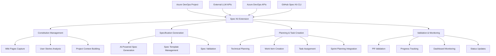

# Azure DevOps Spec Kit Extension - Architecture Analysis & Recommendations

## Current State Analysis

### ✅ What You've Built Right

Your current Azure DevOps extension has several strong foundations:

1. **Proper Extension Structure**: Well-organized with correct manifest, package.json, and TypeScript setup
2. **Core Tasks Implemented**: Specify and Plan tasks are well-structured with proper input validation
3. **AI Assistant Integration**: Support for multiple LLMs (Claude, Gemini, Copilot, Cursor)
4. **Azure DevOps Integration**: Proper use of Azure DevOps SDK and task libraries
5. **Error Handling**: Comprehensive error handling and validation
6. **Documentation**: Good documentation and setup scripts

### 🔧 Areas for Improvement

1. **Missing Core Tasks**: Tasks, Validate-Spec, and Constitution tasks need implementation
2. **Limited Azure DevOps Integration**: Not leveraging Azure DevOps work items, wikis, and PRs
3. **No Dashboard Widgets**: Widgets are defined but not implemented
4. **No Service Hooks**: Missing integration with Azure DevOps events
5. **Limited Constitution Management**: No proper constitution capture and management

## Recommended Architecture

### 1. Logical Architecture Flow



### 2. Enhanced Feature Set

#### Core Features (Current + Enhanced)
1. **Constitution Management**
   - Auto-capture project context from Azure DevOps
   - Wiki page analysis and integration
   - User story pattern recognition
   - Project governance rules extraction

2. **Intelligent Specification Generation**
   - User story to spec conversion
   - Wiki content integration
   - AI-powered spec enhancement
   - Multi-format spec support (Markdown, YAML, JSON)

3. **Advanced Planning & Task Management**
   - Sprint-aware task generation
   - Work item creation with proper linking
   - Task dependency management
   - Effort estimation integration

4. **Comprehensive Validation**
   - PR-based spec compliance checking
   - Work item status synchronization
   - Quality gate enforcement
   - Automated testing integration

5. **Rich Dashboard & Monitoring**
   - Real-time progress tracking
   - AI assistant performance metrics
   - Team productivity analytics
   - Spec compliance reporting

#### Additional Important Features

6. **Multi-Tenant LLM Configuration**
   - Organization-specific LLM settings
   - API key management
   - Model selection and configuration
   - Cost tracking and optimization

7. **Work Item Integration**
   - Automatic work item creation from specs
   - Bidirectional sync between specs and work items
   - Status tracking and updates
   - Comment and discussion integration

8. **Wiki Integration**
   - Auto-sync with Azure DevOps wikis
   - Spec documentation generation
   - Knowledge base management
   - Search and discovery

9. **Pull Request Intelligence**
   - Spec compliance validation
   - Automatic task status updates
   - Code review assistance
   - Merge conflict resolution

10. **Team Collaboration**
    - Role-based access control
    - Approval workflows
    - Notification management
    - Team performance metrics

## Recommended Folder Structure

```
azure-devops-extension/
├── src/
│   ├── core/                          # Core business logic
│   │   ├── constitution/              # Constitution management
│   │   ├── spec-generator/            # Spec generation logic
│   │   ├── plan-generator/            # Planning logic
│   │   ├── task-manager/              # Task management
│   │   └── validator/                 # Validation logic
│   ├── integrations/                  # External integrations
│   │   ├── azure-devops/              # Azure DevOps API integration
│   │   ├── llm-providers/             # LLM provider integrations
│   │   ├── github-spec-kit/           # Spec Kit CLI integration
│   │   └── webhooks/                  # Service hooks
│   ├── tasks/                         # Azure DevOps tasks
│   │   ├── constitution/
│   │   ├── specify/
│   │   ├── plan/
│   │   ├── tasks/
│   │   ├── validate-spec/
│   │   └── update-status/
│   ├── widgets/                       # Dashboard widgets
│   │   ├── spec-progress/
│   │   ├── ai-status/
│   │   ├── team-metrics/
│   │   └── compliance-dashboard/
│   ├── services/                      # Background services
│   │   ├── webhook-processor/
│   │   ├── status-synchronizer/
│   │   └── notification-service/
│   ├── shared/                        # Shared utilities
│   │   ├── types/
│   │   ├── utils/
│   │   ├── constants/
│   │   └── config/
│   └── tests/                         # Test files
│       ├── unit/
│       ├── integration/
│       └── e2e/
├── config/                            # Configuration files
│   ├── llm-providers.json
│   ├── task-templates.json
│   └── validation-rules.json
├── templates/                         # Template files
│   ├── spec-templates/
│   ├── constitution-templates/
│   └── work-item-templates/
├── docs/                             # Documentation
│   ├── architecture/
│   ├── api/
│   └── user-guide/
└── scripts/                          # Build and deployment scripts
    ├── build/
    ├── test/
    └── deploy/
```

## Development Process Guidelines

### 1. Phase 1: Foundation (Weeks 1-2)
- [ ] Implement missing core tasks (Tasks, Validate-Spec, Constitution)
- [ ] Set up proper folder structure
- [ ] Implement basic Azure DevOps API integration
- [ ] Create configuration management system

### 2. Phase 2: Core Features (Weeks 3-4)
- [ ] Implement constitution management
- [ ] Build work item integration
- [ ] Create wiki integration
- [ ] Implement multi-tenant LLM configuration

### 3. Phase 3: Advanced Features (Weeks 5-6)
- [ ] Build dashboard widgets
- [ ] Implement service hooks
- [ ] Create PR validation system
- [ ] Add team collaboration features

### 4. Phase 4: Polish & Testing (Weeks 7-8)
- [ ] Comprehensive testing
- [ ] Performance optimization
- [ ] Documentation completion
- [ ] User acceptance testing

### 5. Phase 5: Deployment & Monitoring (Weeks 9-10)
- [ ] Production deployment
- [ ] Monitoring setup
- [ ] User training
- [ ] Feedback collection

## Technical Implementation Details

### 1. Constitution Management
```typescript
interface ConstitutionManager {
  captureProjectContext(projectId: string): Promise<ProjectContext>;
  analyzeWikiPages(wikiId: string): Promise<WikiAnalysis>;
  extractUserStoryPatterns(workItems: WorkItem[]): Promise<UserStoryPatterns>;
  generateConstitution(context: ProjectContext): Promise<Constitution>;
}
```

### 2. Work Item Integration
```typescript
interface WorkItemManager {
  createWorkItemsFromSpec(spec: Specification): Promise<WorkItem[]>;
  updateWorkItemStatus(workItemId: string, status: WorkItemStatus): Promise<void>;
  syncWithPullRequest(prId: string): Promise<SyncResult>;
  linkSpecToWorkItem(specId: string, workItemId: string): Promise<void>;
}
```

### 3. LLM Provider Abstraction
```typescript
interface LLMProvider {
  generateSpecification(prompt: string, context: ProjectContext): Promise<Specification>;
  generatePlan(spec: Specification, techStack: string): Promise<Plan>;
  validateCompliance(code: string, spec: Specification): Promise<ValidationResult>;
  estimateEffort(task: Task): Promise<EffortEstimate>;
}
```

## Security Considerations

1. **API Key Management**: Secure storage and rotation of LLM API keys
2. **Data Privacy**: Ensure sensitive project data is handled securely
3. **Access Control**: Implement proper role-based access control
4. **Audit Logging**: Track all actions for compliance and debugging

## Performance Considerations

1. **Caching**: Implement intelligent caching for frequently accessed data
2. **Async Processing**: Use background processing for heavy operations
3. **Rate Limiting**: Implement proper rate limiting for API calls
4. **Monitoring**: Set up comprehensive monitoring and alerting

## Conclusion

Your current extension is a solid foundation, but needs significant enhancement to meet the full vision of integrating Spec Kit with Azure DevOps. The recommended architecture provides a scalable, maintainable solution that leverages Azure DevOps capabilities while maintaining the power of Spec Kit's AI-driven development approach.

The key is to build incrementally, starting with the core missing pieces and gradually adding advanced features. This approach ensures you can deliver value early while building toward the complete vision.


